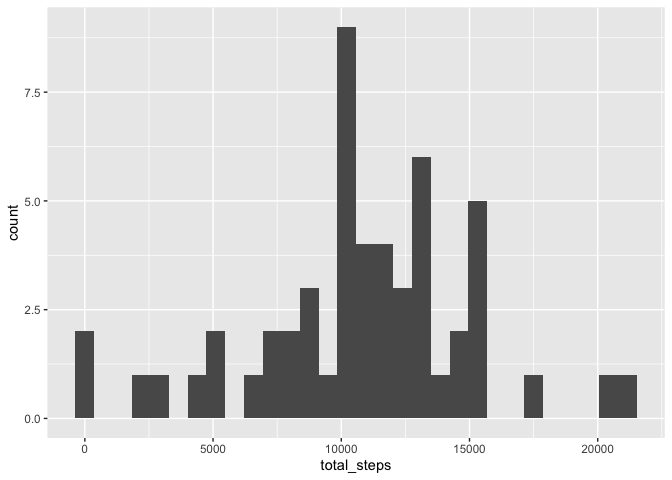
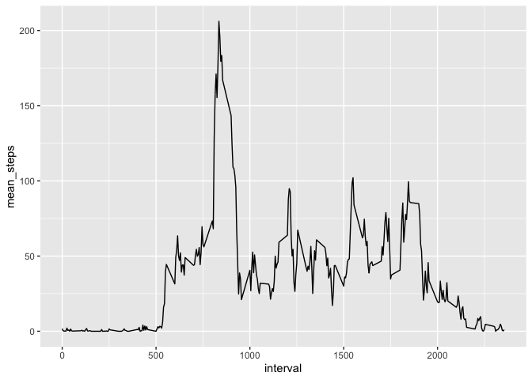
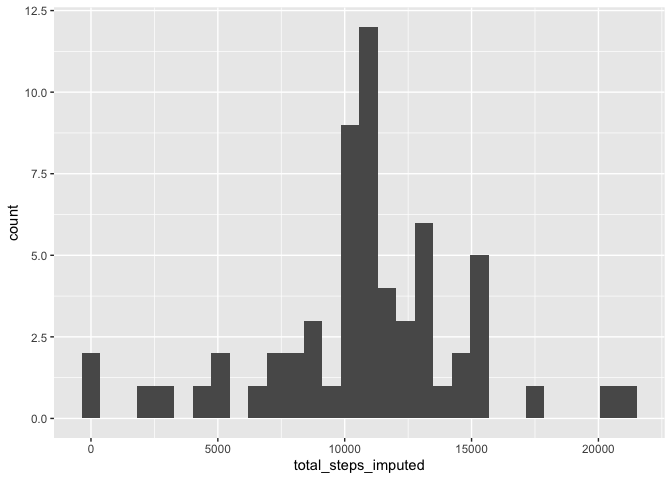
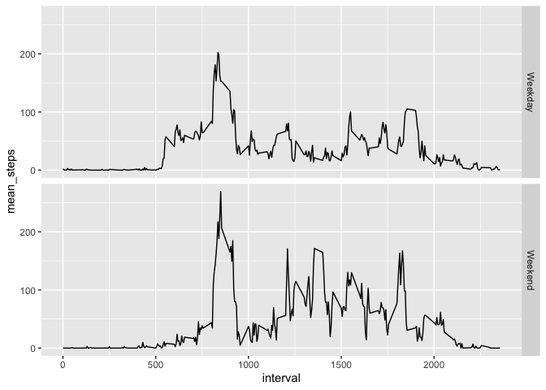

## Loading and preprocessing the data

```r
library(ggplot2)
library(dplyr)
library(lubridate)
options(device = "quartz")
data = read.csv("activity.csv")
```

## What is mean total number of steps taken per day?

```r
byday <- data %>% group_by(date) %>% summarise(total_steps = sum(steps))
ggplot(data=byday,aes(x=total_steps)) + geom_histogram()
```

```
## `stat_bin()` using `bins = 30`. Pick better value with `binwidth`.
```

<!-- -->

```r
mean(byday$total_steps,na.rm=TRUE)
```

```
## [1] 10766.19
```

```r
median(byday$total_steps,na.rm=TRUE)
```

```
## [1] 10765
```

## What is the average daily activity pattern?

```r
byinterval <- data %>% group_by(interval) %>% summarise(mean_steps = mean(steps,na.rm = TRUE))
ggplot(data=byinterval,aes(x=interval,y=mean_steps)) + geom_line()
```

<!-- -->

```r
byinterval[which.max(byinterval$mean_steps),1]
```

```
## # A tibble: 1 x 1
##   interval
##      <int>
## 1      835
```

## Imputing missing values

```r
sum(is.na(data$steps))
```

```
## [1] 2304
```

```r
data_new <- data %>% left_join(byinterval, by=c("interval","interval"))
data_new <- data_new %>% mutate(steps_imputed = ifelse(is.na(steps),mean_steps,steps))
byday_new <- data_new %>% group_by(date) %>% summarise(total_steps_imputed = sum(steps_imputed))
ggplot(data=byday_new,aes(x=total_steps_imputed)) + geom_histogram()
```

```
## `stat_bin()` using `bins = 30`. Pick better value with `binwidth`.
```

<!-- -->

```r
mean(byday_new$total_steps_imputed,na.rm=TRUE)
```

```
## [1] 10766.19
```

```r
median(byday_new$total_steps_imputed,na.rm=TRUE)
```

```
## [1] 10766.19
```

## Are there differences in activity patterns between weekdays and weekends?

```r
data_new <- data %>% mutate(day = as.factor(ifelse(wday(ymd(as.character(date))) <=5 ,"Weekday","Weekend")))
byinterval_day <- data_new %>% group_by(interval,day) %>% summarise(mean_steps = mean(steps,na.rm = TRUE))
ggplot(data=byinterval_day,aes(x=interval,y=mean_steps)) + geom_line() + facet_grid(rows = vars(day))
```

<!-- -->


