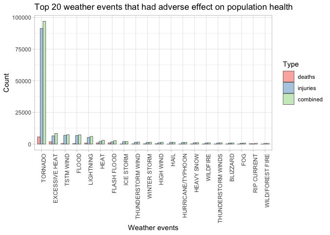
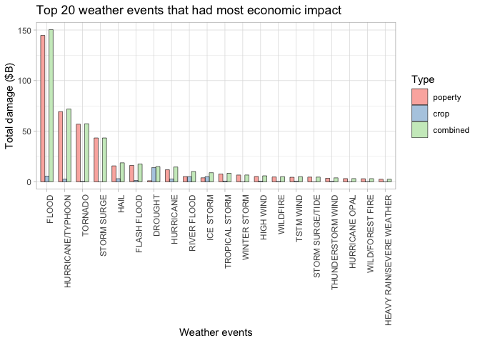

## Synopsis 
In this analysis the top 20 weather events were determined for impact to population health and economy. The fatalities and injuries were used as a proxy for health and property and crop damage were used as proxy for economic impact. The analysis showed that Tornados caused the most human injuries and deaths. For property damage the flooding, hurricanes and tornados were the worst weather events. 

## Data processing
First the data is downloaded from the NOAA website and the csv file is read. 

```r
library(ggplot2)
library(dplyr)
library(reshape2)

options(device = "quartz")
if (!file.exists("repdata_data_StormData.csv.bz2"))
  download.file("https://d396qusza40orc.cloudfront.net/repdata%2Fdata%2FStormData.csv.bz2","repdata_data_StormData.csv.bz2")
data <- read.csv("repdata_data_StormData.csv.bz2",sep=",")
```

Next the property damage needs to be computed since some of the damage is in units of K, M or B. In order to do that a new column is created that converts the multiplier to a numeric value.  

```r
data <- data %>% mutate(prop_multiplier = case_when(PROPDMGEXP == "K" ~ 1000, PROPDMGEXP == "M" ~ 1000000, PROPDMGEXP == "B" ~ 1000000000, TRUE ~ 0 ))
data <- data %>% mutate(crop_multiplier = case_when(CROPDMGEXP == "K" ~ 1000, CROPDMGEXP == "M" ~ 1000000, CROPDMGEXP == "B" ~ 1000000000, TRUE ~ 0 ))
```

Then the multiplier and the damage value is used to compute the actual damage in dollar amount

```r
data <- data %>% mutate(property_damage = PROPDMG*prop_multiplier)
data <- data %>% mutate(crop_damage = CROPDMG*crop_multiplier)
```

## Results
The data shows that the weather event that is by far worst for population health is Tornado. This event is 5-10 times more likely to cause an injury than any other event. For economic consequences just one event was not much worse than any other. The mosyt damaging events were FLOOD, HURRICANE, TORNADO and STORM SURGE. These events damaged the property the most. The most crop damage was caused by draught, as expected. 

#### Q1. Across the United States, which types of events (EVTYPE variable) are most harmful with respect to population health?  
In order to answer this question all the data is grouped by the weather event and then human health is estimated by adding fatalities, injuries and combining them. This data is the plotted on a barplot for the top 20 contributors. 

```r
data.summary <- data %>% group_by(EVTYPE) %>% summarise(deaths = sum(FATALITIES), injuries = sum(INJURIES), combined =   sum(FATALITIES) + sum(INJURIES) ) %>% arrange(desc(combined)) 
data.summary.top20 <- data.summary[1:20,] %>% melt(value.name = 'Count', id = "EVTYPE", variable.name = "type" )

ggplot(data = data.summary.top20, aes(x=reorder(EVTYPE,-Count), y=Count, fill=factor(type))) + 
  geom_bar(stat = 'identity', position = 'dodge', width=0.7,color='black',size=0.2) + 
  labs(x="Weather events",y="Count",fill="Type") + 
  ggtitle("Top 20 weather events that had adverse effect on population health") + 
  scale_fill_brewer(palette = 'Pastel1') + theme_light() +
  theme(axis.text.x = element_text(angle = 90, hjust = 1))
```

<!-- -->

#### Q2. Across the United States, which types of events have the greatest economic consequences?
In order to answer this question all the data is grouped by the weather event and then economic consequence is estimated by adding property damage, crop damage and combining it. This data is the plotted on a barplot for the top 20 contributors. 

```r
data.summary <- data %>% group_by(EVTYPE) %>% summarise(poperty = sum(property_damage), crop = sum(crop_damage), combined =   sum(property_damage) + sum(crop_damage) ) %>% arrange(desc(combined)) 
data.summary.top20 <- data.summary[1:20,] %>% melt(value.name = 'Total', id = "EVTYPE", variable.name = "type" )

ggplot(data = data.summary.top20, aes(x=reorder(EVTYPE,-Total), y=Total, fill=factor(type))) + 
  geom_bar(stat = 'identity', position = 'dodge', width=0.7,color='black',size=0.2) + 
  labs(x="Weather events",y="Total damage ($B)",fill="Type") + 
  ggtitle("Top 20 weather events that had most economic impact") + 
  scale_fill_brewer(palette = 'Pastel1') + theme_light() +
  theme(axis.text.x = element_text(angle = 90, hjust = 1)) + 
  scale_y_continuous(labels = function(x) x/1000000000)
```

<!-- -->
